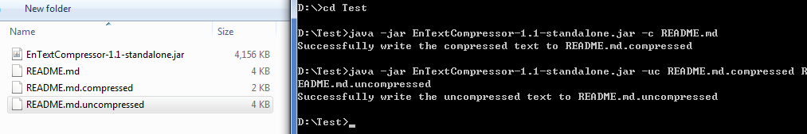

A simple Java library for lossless compression of short English natural language texts. To ensure performance, the dominant language of the text to compress should be English, but the text can also be mixed with other non-alphanumeric or rare characters. 

#### Dependncies

The trove library. Add both 'trove-3.1a1.jar' and 'EnTextCompressor-1.1.jar' in the lib folder to build path to compress English texts.

#### Example

The following snippet is a usage example for compression from String to byte array and uncompression from byte array to String

```java

String text = "The ticks that transmit Lyme disease, a debilitating flulike illness caused by Borrelia bacteria, are spreading rapidly across the United States. A new study shows just how rapidly. Over the past 20 years, the two species known to spread the disease to humans have together advanced into half of all the counties in the United States."

//compress to byte array
byte[] bytes = EnTextCompressor.compress(text);

//uncompress from byte array
String restoredText = EnTextCompressor.uncompress(bytes);

```




To test with the runnable jar, use command 'java -jar EnTextCompressor-1.1-standalone.jar -c path/to/original-txt path/to/compressed-file(optional)' to compress a text file, and 'java -jar EnTextCompressor-1.1-standalone.jar -uc path/to/compressed-file path/to/original-txt(optional)' to uncompress it.


#### Feature

Performs better than GZ in terms of compression rate for short (10000 characters or less, especially 1000 characters or less) English natural language texts. 


Suppose:

```java
double originalLength = text.getBytes().length;
byte[] bytes = EnTextCompressor.compress(text);

ByteArrayOutputStream baos = new ByteArrayOutputStream();
ObjectOutputStream oos = new ObjectOutputStream(useGZip ? new GZIPOutputStream(baos) : baos);
oos.writeObject(text);
oos.close();
byte[] bytes2 = baos.toByteArray();

double rate_this = originalLength / bytes.length;
double rate_gz = originalLength / bytes2.length;

```

The average compression rates (compressed size / original size) tested on many Wikipedia texts are approximately:
	  
	 * 50 characters (50-character windows): 
	 * rate_this = 0.376
	 * rate_gz = 1.503
	 * 
	 * 100 characters:
	 * rate_this = 0.336
	 * rate_gz = 1.12
	 * 
	 * 200 characters:
	 * rate_this = 0.316
	 * rate_gz = 0.868
	 * 
	 * 500 characters:
	 * rate_this = 0.304
	 * rate_gz = 0.663
	 * 
	 * 1000 characters:
	 * rate_this = 0.299
	 * rate_gz = 0.574
	 * 
	 * 2000 characters:
	 * rate_this = 0.295
	 * rate_gz = 0.517
	 * 
	 * 5000 characters:
	 * rate_this = 0.294
	 * rate_gz = 0.468
	 * 
	 * 10000 characters:
	 * rate_this = 0.294
	 * rate_gz = 0.438
	
	 * english texts with size around 5M
	 * rate_this = 0.293
	 * rate_gz = 0.367
	 *

#### Speed

In terms of compression speed, significantly faster than GZ for tiny (<1000 characters) sized texts, and approximately as fast as GZ for texts with size around 5M . 

#### Usage scenarios

For example, can be used to compress a few columns of short English natural language texts not for searching in a large database table. Not recommended for compressing large (>10M) texts.


